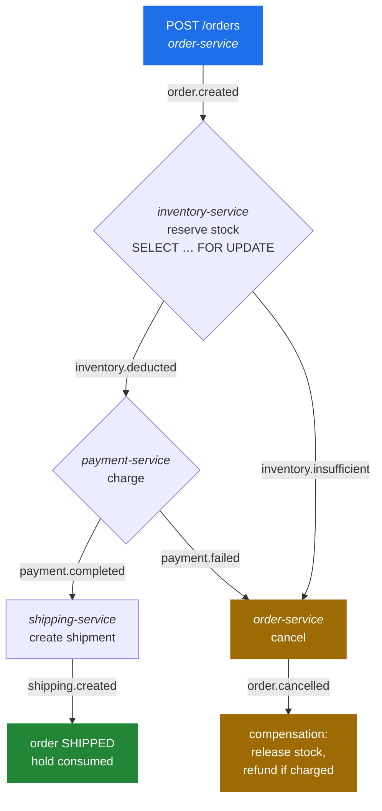
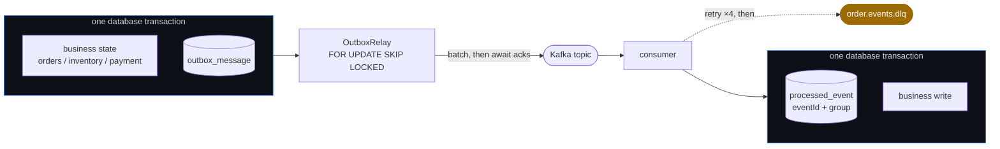

# Event-Driven Order Platform


An e-commerce order fulfillment platform built as a **choreographed saga** over Apache Kafka. Six
Spring Boot services coordinate one order lifecycle with no synchronous calls between them — every
state transition is an event.

The interesting part is not the happy path. It is what happens when a database commit succeeds and
the Kafka send does not, when a consumer sees the same event twice after a rebalance, when payment
fails after stock was already reserved, and when a single malformed record threatens to stall a
partition forever. Those four problems are what this codebase is organised around.

---

## The saga



`notification-service` fans out customer notifications and `analytics-service` tails every topic;
neither participates in the saga.

The steps are deliberately serial. Charging in parallel with the stock check is the obvious way to
cut latency, and it means taking money for orders that turn out to be unfulfillable — while leaving
the order's own state machine with no linear order to enforce.

---

## How each guarantee is made



| Problem | Approach |
|---|---|
| **Dual write** — state commits but the send fails, or the reverse | State and event commit together via a [transactional outbox](platform-messaging/src/main/java/io/github/evelynkk/orderplatform/messaging/outbox/OutboxRecorder.java); a relay publishes afterwards. `Propagation.MANDATORY` makes a missing `@Transactional` fail loudly instead of silently losing the guarantee |
| **Duplicate delivery** — at-least-once means redelivery is normal | The business write and an `(eventId, consumerGroup)` marker commit in [one transaction](platform-messaging/src/main/java/io/github/evelynkk/orderplatform/messaging/idempotency/IdempotentEventProcessor.java). The existence check is a fast path; the composite primary key is what holds under concurrency |
| **Relay contention** — several instances draining one table | `SELECT … FOR UPDATE SKIP LOCKED` lets N relays claim disjoint batches with no coordinator |
| **Partial failure** — payment fails after stock is held | `order.cancelled` drives every rollback path. Reservations are persisted, so the release knows how much to give back rather than trusting the failure event |
| **Hot keys** — a promoted SKU draws every order at once | Stock takes a row lock rather than retrying an optimistic version, which collapses into a retry storm under contention |
| **Out-of-order events** — topics order partitions, not each other | The order aggregate distinguishes a stale replay (ignored) from a genuine gap (`OutOfOrderEventException`, retried once the missing event lands) |
| **Poison pills** | Transient failures retry with capped backoff; deterministic ones go straight to the DLQ instead of stalling the partition |
| **Service coupling** | payment-service copies the order amount from `order.created` rather than calling order-service back, so no service needs another to be up |

---

## Failure handling

A handler that throws is retried in place with exponential backoff (500 ms, doubling, capped at
8 s, four attempts) and then dead-lettered. Retries block the partition, which is the deliberate
choice here: every event for one order shares a partition, and non-blocking retry topics would let
a later event overtake the one being retried. The backoff ceiling bounds the cost.

Failures retrying cannot fix skip the backoff — a `PermanentEventException`, or a record that could
not be deserialized at all. Consumers wrap their deserializer in `ErrorHandlingDeserializer` so a
malformed record surfaces as a failed record the handler can set aside; deserializing directly
throws inside the poll loop, where nothing can recover it and the container spins on the same
offset forever.

Everything lands in one `order.events.dlq` with the original topic, partition, offset, and root
cause in headers:

```bash
curl "http://localhost:8081/admin/dlq?limit=20"          # what failed and why
curl -X POST "http://localhost:8081/admin/dlq/replay"    # put it back once the cause is fixed
```

Replay commits its offsets only after records are back on their original topics, so an interrupted
replay repeats rather than skips — harmless, because consumers deduplicate on `eventId`.

---

## Measured behaviour

2000 orders at concurrency 64, everything on one 4-core machine. Full method, environment, and
analysis in [docs/benchmark.md](docs/benchmark.md).

| | Baseline | Tuned | |
|---|---:|---:|---|
| Orders accepted | 315/s | **941/s** | 3.0× |
| Orders fulfilled end to end | 15.8/s | **42.6/s** | 2.7× |
| Submit p99 | 488 ms | **188 ms** | −61% |
| End-to-end p99 (unloaded) | 6563 ms | **1473 ms** | −78% |

The tuning that produced this was not the tuning that looked obvious. Matching listener concurrency
to partition count — the textbook move — barely moved throughput and **tripled** submit p99, because
six services multiplied that setting by their listener count into more than a hundred consumer
threads on four cores, each service's connection pool smaller than its own thread count. What
worked was giving parallelism only to the fulfillment path, sizing pools above thread counts, and
cutting the outbox poll interval, which the saga pays four times over.

Accepting and fulfilling scale independently: submits stay at p99 188 ms under saturation while the
backlog grows. That is precisely what the outbox buys — callers never wait for the slowest
participant.

---

## Observability

`docker compose up -d` brings up Prometheus and a provisioned Grafana dashboard at
<http://localhost:3000>.

Outbox health is reported as **backlog age**, not just depth. Depth spikes on any write burst even
when the relay is keeping up; age of the oldest unpublished row stays near zero while draining and
climbs without bound the moment the relay stops. Deduplication is counted with an outcome tag, so a
redelivery storm is visible instead of looking like healthy traffic.

---

## Tech stack

Java 17 · Spring Boot 3.2 · Spring Kafka · Apache Kafka 3.6 · PostgreSQL 16 · Flyway · Micrometer /
Prometheus / Grafana · Testcontainers · Docker Compose · GitHub Actions → GHCR

---

## Modules

```
event-driven-order-platform/
├── platform-events/        shared event records
├── platform-messaging/     outbox, deduplication, retry/DLQ, metrics — built once, used by all
├── order-service/          8081 — intake, order state machine, saga projection, DLQ admin
├── inventory-service/      8082 — stock reservation, release, commit
├── payment-service/        8083 — charge and refund
├── shipping-service/       8084 — shipment creation
├── notification-service/   8085 — customer notifications
├── analytics-service/      8086 — event tailing
├── loadtest/               dependency-free JDK load harness
└── docker/                 Postgres init, Prometheus scrape config, Grafana provisioning
```

---

## Running locally

```bash
# 5432 is often taken by a locally installed Postgres, which silently wins over the published
# container port. Setting both keeps the services pointed at the right database.
export POSTGRES_HOST_PORT=5433 POSTGRES_PORT=5433

docker compose up -d          # Kafka, Zookeeper, Postgres, Kafka UI, Prometheus, Grafana
mvn clean package -DskipTests

for svc in order inventory payment shipping notification analytics; do
  java -jar ${svc}-service/target/${svc}-service-1.0.0-SNAPSHOT.jar &
done
```

Topics are provisioned on broker startup and schemas by Flyway on first connect. Kafka UI is at
<http://localhost:8080>, Grafana at <http://localhost:3000>.

Or skip the build and run the images CI publishes:

```bash
export DOCKER_IMAGE_OWNER=evelyn-kk
docker compose -f docker-compose.images.yml up -d
```

### Exercising the saga

```bash
# Happy path: CREATED -> INVENTORY_RESERVED -> PAID -> SHIPPED
ORDER=$(curl -s -X POST http://localhost:8081/orders \
  -H "Content-Type: application/json" \
  -d '{"userId":"user-001","productId":"SKU-1001","quantity":2,"totalAmount":199.00}' \
  | python3 -c 'import sys,json; print(json.load(sys.stdin)["orderId"])')

curl -s "http://localhost:8081/orders/$ORDER"

# Insufficient stock -> inventory.insufficient -> order.cancelled
curl -X POST "http://localhost:8081/orders?scenario=OUT_OF_STOCK" \
  -H "Content-Type: application/json" \
  -d '{"userId":"user-001","productId":"SKU-1001","quantity":2,"totalAmount":199.00}'

# Payment declined after stock was held -> order.cancelled -> stock released
curl -X POST "http://localhost:8081/orders?scenario=PAYMENT_FAILED" \
  -H "Content-Type: application/json" \
  -d '{"userId":"user-001","productId":"SKU-1001","quantity":5,"totalAmount":199.00}'
```

### Load test

```bash
java loadtest/SagaLoadTest.java --orders 2000 --concurrency 64 --product SKU-LOADTEST
```

---

## Topics

| Topic | Meaning | Partitions |
|---|---|---|
| `order.created` | Order accepted | 6 |
| `inventory.deducted` | Stock reserved | 6 |
| `inventory.insufficient` | Reservation rejected | 6 |
| `payment.completed` | Charge succeeded | 6 |
| `payment.failed` | Charge declined | 6 |
| `shipping.created` | Shipment created | 6 |
| `order.cancelled` | Compensation trigger | 6 |
| `notification.send` | Outbound notifications | 6 |
| `order.events.dlq` | Dead letters from every topic | 3 |

Six partitions caps per-service consumer parallelism; `orderId` keying keeps per-order ordering
intact as consumers scale out.

---

## Tests

Integration tests run against real Postgres and Kafka via Testcontainers, because the behaviour
under test *is* the interaction between them — a transaction spanning a business write and an
outbox row, and a deduplication guarantee resting on a database constraint. Coverage includes
duplicate delivery applying once, saga rollback releasing stock, late events failing to resurrect a
cancelled order, poison-pill dead lettering, and replay.

```bash
mvn clean verify
```

On Colima, point Testcontainers at its socket first:

```bash
export DOCKER_HOST="unix://$HOME/.colima/default/docker.sock"
export TESTCONTAINERS_DOCKER_SOCKET_OVERRIDE=/var/run/docker.sock
```

The build pins the Docker API version it negotiates (`docker.api.version`, default `1.43`) because
docker-java's default of 1.32 is rejected by Docker Engine 25 and newer.

---

## CI/CD

`.github/workflows/ci.yml` runs on every push and pull request: `mvn clean verify` including the
Testcontainers suite, then builds and pushes six images to GHCR (skipped on pull requests). Tags:
`sha-<short>`, `latest` on `main`, `vX.Y.Z` on tags.

---

## Known limitations

Payment approval is a threshold check rather than a call to a provider, and shipment creation
generates a tracking number rather than booking a courier — the transactional and compensating
behaviour around them is real, the external integrations are not. notification-service and
analytics-service are stateless log consumers. Serialization is JSON with a `__TypeId__` header;
moving the contracts to Avro behind a Schema Registry, with compatibility checks in CI, is the
natural next step.
